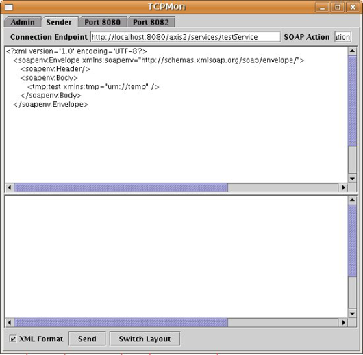
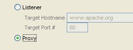

# Other Usages of TCPMon

TCPMon is primarily used for message monitoring. Additionally, TCPMon
can also be used for sending requests to web services and as a proxy
service. Refer [Starting TCPMon](../tcp/starting_tcp_mon.md) for
details on how to start the tool.

## Sending requests to Web services

TCPMon can also be used as a request sender for Web services. The
request SOAP message can be pasted on the **Send** screen and sent directly
to the server.

## As a proxy

TCPMon can act as a proxy. To start it in proxy mode, select the **Proxy**
option shown below. When acting as a proxy, TCPMon only needs the listener port to
be configured.

## Advanced settings

TCPMon can simulate a slow connection, in which case the delay and the
bytes to be dropped can be configured. This is useful when testing Web
services.

Also, if HTTP proxy support is required, that can also be set on the
admin screen.
