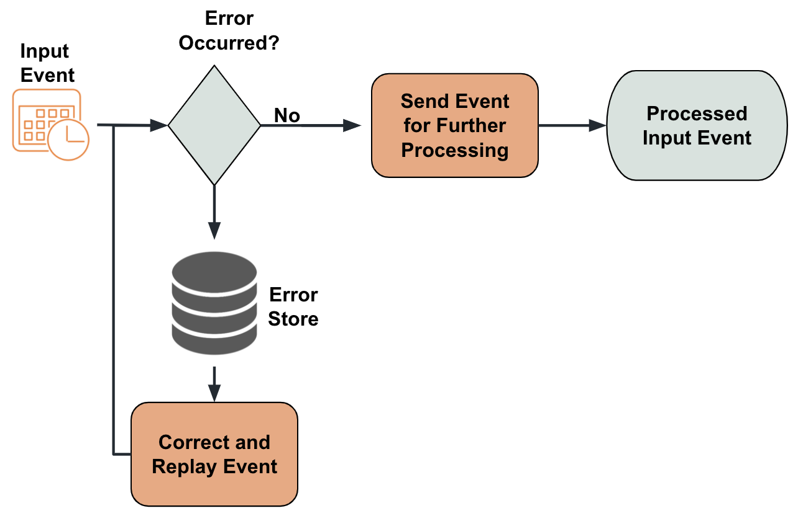
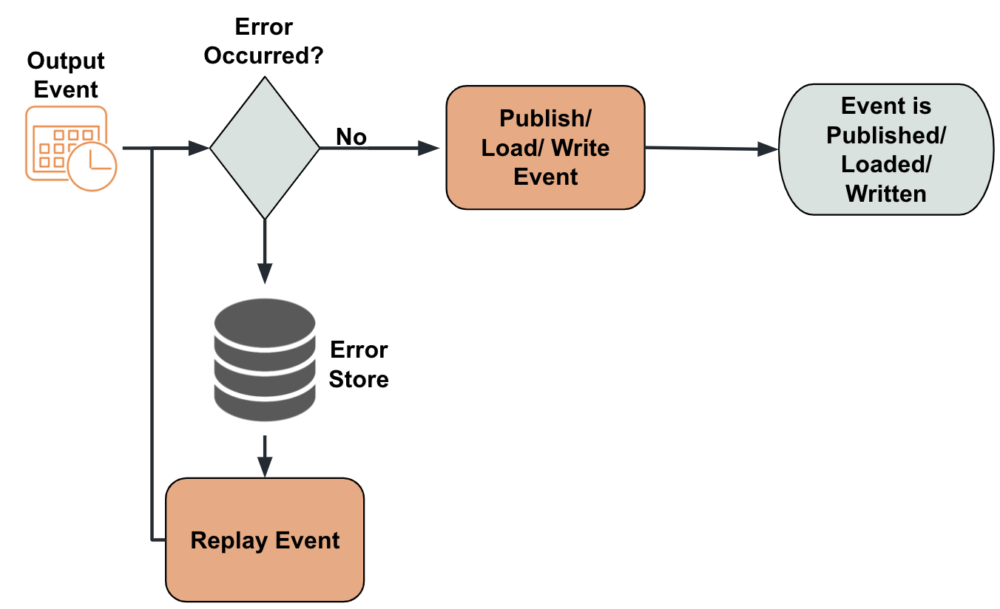
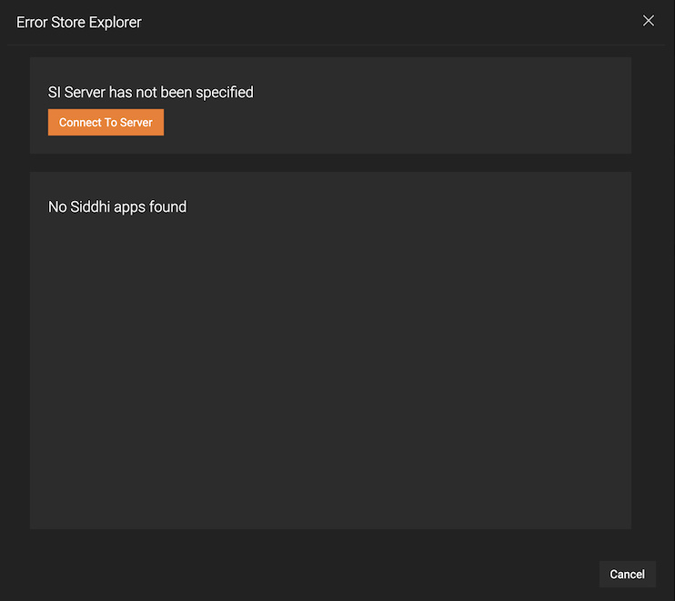
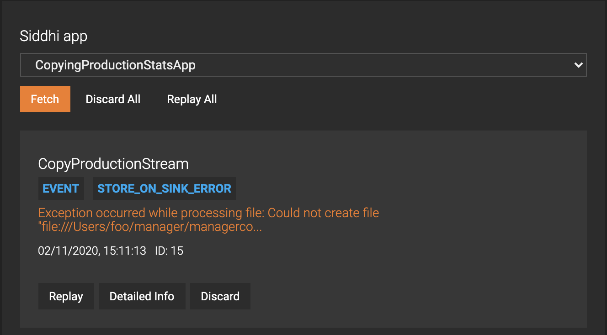
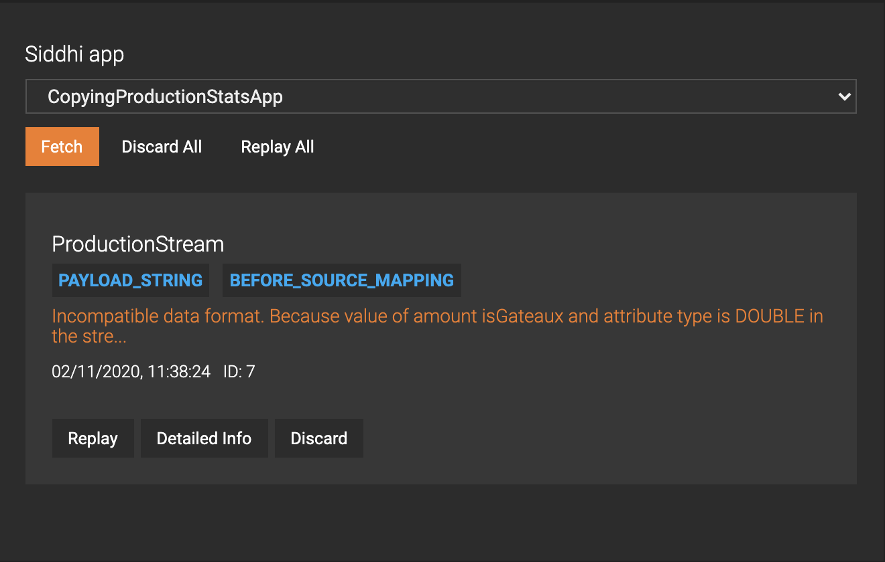
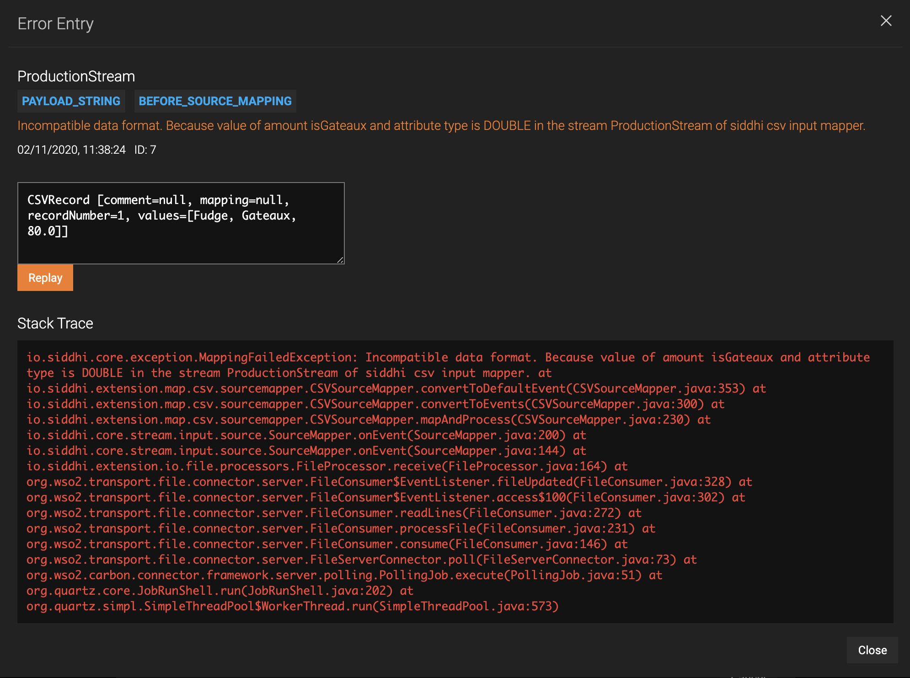

# Handling Errors

WSO2 Streaming Integrator allows you to handle any errors that may occur when handling streaming data in a graceful manner. 

The possible actions that you can take for events with errors are:

- Storing
- Logging and dropping
- Streaming
- Waiting

This section explains the different types of errors that can occur and how they can be handled.

## Storing events with errors

This involves storing the events with errors in the error store. 

To do this, you need to enable the error store in the `<SI_HOME>/conf/server/deployment.yaml` file by adding the following configuration.

```
error.store:
  enabled: true
  bufferSize: 1024
  dropWhenBufferFull: true
  errorStore: org.wso2.carbon.streaming.integrator.core.siddhi.error.handler.DBErrorStore
  config:
    datasource: ERROR_STORE_DB
    table: ERROR_STORE_TABLE
```
- `bufferSize` denotes the size of the ring buffer that is used in the disruptor when publishing events to the error store. This has to be a power of two. If not, it throws an exception during initialization. The default buffer size is `1024`.
- If the `dropWhenBufferFull` is set to `true`, the event is dropped when the capacity of the ring buffer is insufficient.

Once the error store is enabled, you need to add a configuration for the data source you are connecting to the error store (in the above example `ERROR_STORE_DB`) in the `<SI_HOME>/conf/server/deployment.yaml` file. Then you can create the database in which you want to store the events with errors and link to it from the data source.

This can be used with the following:

- Siddhi Streams

    

    This on-error action can be specified for a  stream via the `@OnError()` annotation. 

    The Siddhi query uses the `cast("abc", "double")` which intentionally generates an error for testing purposes. 

    ```
    @OnError(action='STORE')
    define stream StreamA (symbol string, amount double);
    
    from StreamA[cast("abc", "double") > 100]
    insert into StreamB;
    ```
  
  If you do not specify the on-error action for a stream  via the `@OnError()` annotation, the event is logged and dropped.
    
- Sinks

    

    You can specify an on-error action by including the `on-error` parameter within the sink configuration as shown below.
    
    ```
    @sink(type = 'http', on.error='STORE', blocking.io='true', 
          publisher.url = "http://localhost:8090/unavailableEndpoint", 
          method = "POST", @map(type = 'json'))
    define stream StreamA (name string, volume long);
    ```

- Source mappers

   If the `error.store` is enabled in the `<SI_HOME>/conf/server/deployment.yaml` file, mapping errors are automatically added to the error store.
   
### Try it out

To understand how you can store erroneous events in a real world scenario, consider a sweet factory where production statistics are written into a file. The same file content needs to be copied into another file for the factory manager. In order to make sure that none of the production records is missed in the manager's copy, the factory foreman needs the erroneous events saved in the error store so that he can check the errors, correct than and then replay them.

To try out storing errors in the store, follow the steps below:

1. To configure the error store in which you can store events, follow the steps below.

    1. Start the MySQL server if it is not already started.
    
    2. Create a new database named `siddhierrorstoredb`; by issuing the following command in the MySQL console.
    
        `mysql> create database siddhierrorstoredb;`
        
    3. To switch to the new database, issue the following command.
    
        `mysql> use siddhierrorstoredb;`
        
    4. To enable the error store, open the `<SI_HOME>/conf/server/deployment.yaml` file and add a configuration as follows:
    
        ```
        error.store:
          enabled: true
          bufferSize: 1024
          dropWhenBufferFull: true
          errorStore: org.wso2.carbon.streaming.integrator.core.siddhi.error.handler.DBErrorStore
          config:
            datasource: SIDDHI_ERROR_STORE_DB
            table: SIDDHI_ERROR_STORE_TABLE
        ```
    5. The above configuration refers to a data source named `SIDDHI_ERROR_STORE_DB`. Define this data source as follows under `Data sources` in the `<SI_HOME>/conf/server/deployment.yaml` file.
    
        ```
        - name: SIDDHI_ERROR_STORE_DB
          description: The datasource used for Siddhi error handling feature
          jndiConfig:
            name: jdbc/SiddhiErrorStoreDB
          definition:
            type: RDBMS
            configuration:
              jdbcUrl: 'jdbc:mysql://localhost:3306/siddhierrorstoredb?useSSL=false'
              username: root
              password: root
              driverClassName: com.mysql.jdbc.Driver
              minIdle: 5
              maxPoolSize: 50
              idleTimeout: 60000
              connectionTestQuery: SELECT 1
              validationTimeout: 30000
              isAutoCommit: false
        ```

2. Download the [productions.csv file](https://github.com/wso2/docs-ei/blob/master/en/streaming-integrator/docs/examples/resources/productions.csv) and save it in a location of your choice in your machine.

3. [Create a Siddhi application](../develop/streaming-apps/creating-a-Siddhi-Application.md) as follows and [deploy it in the Streaming Integrator server](../develop/streaming-apps/deploying-Streaming-Applications.md).

    ```
    @App:name("CopyingProductionStatsApp")
    
    @source(type='file', mode='LINE',
       file.uri='file:/Users/foo/productions.csv',
       tailing='true',
       @map(type='csv'))
    @onError(action='STORE') 
    define stream ProductionStream (name string,amount double);
    
    @sink(type='file',
        on.error='STORE',
        file.uri = "/Users/foo/manager/managercopy.csv",
        @map(type='csv'))
    define stream CopyProductionStream (name string,amount double);
    
    from ProductionStream
    select *
    insert into CopyProductionStream;
    ```   
   
   The above Siddhi application simply copied content from one file to another. Any mapping errors generated when you run it can be stored in the error store you configured.
   
4. Start the MySQL server. If the Streaming Integrator server and Streaming Integrator Tooling are not already started, start them too.

5. Access and open the Streaming Integrator Tooling.

6. To open the Error Store Explorer, click **Tools** and then click **Error Store Explorer**.
   
    The Error Store Explorer opens as shown below. 
      
    
    
7. Click **Connect to Server**. Then enter information as follows:

    To check the port of the Streaming Integrator Server, Open <SI_HOME>/conf/server/deployment.yaml file. Under Listener Configurations of wso2.transport.http, locate the listener configuration with msf4j-https as the ID and specify its port as shown in the extract below.
   
    
    
    |**Parameter**|**Value**    |
    |-------------|-------------|
    |**Host**     | `localhost` |
    |**Port**     | `9443`      |
    |**Username** | `admin`     |
    |**Password** | `admin`     |
    
    Then click **Connect**.

8. Now let's generate some errors for testing purposes as follows:

    **Generating a sink error**

    1. Be sure  that the file path you specified in the sink configuration is not actually available. For example, in this scenario, you can make sure that the `manager` sub-directory in the `/Users/foo/manager/managercopy.csv` path is not available.
    
    2. Now create a file event by entering a new row in the input file (in this scenario, `/Users/foo/productions.csv`) as follows.
    
        `Crossaints,90.0`
        
    3. Access Streaming Integrator Tooling and click **Tools** -> **Error Store Explorer**. Then in the **Siddhi App** section, select **CopyingProductionStatsApp** Siddhi application from the drop down list. The error store displays the sink error as follows.
    
        
    
    4. To correct the error and replay it, follow the procedure below:
    
        1. Correct the file path. For example, in this scenario, you can add a directory named `manager` in the `Users/foo` directory so that the `/Users/foo/manager/` is a path that actually exists, enabling WSO2 Streaming Integrator to generate the `managercopy.csv` in it.
        
        2. In the **Error Store Explorer** dialog box, click **Replay** for the event.
        
            As a result, the **Error Entry** dialog box closes, and the **Error Store Explorer** dialog box does not display any errors.
    
    **Generating a mapping error**
    
    1. Open the input file (in this scenario, `/Users/foo/productions.csv`) and enter a new row in it in the wrong format as shown below.
    
        `Fudge,Gateaux,80.0`
        
        The above entry is erroneous because it has two string values instead of one.
        
    2. Access Streaming Integrator Tooling and click **Tools** -> **Error Store Explorer**. Then in the **Siddhi App** section, select **CopyingProductionStatsApp** Siddhi application from the drop down list. The error store displays the mapping error as follows.
    
        
        
    3. To correct this error and replay the event, follow the procedure below:
    
        1. Click **Detailed Info**. This opens the **Error Entry** dialog box where the event is displayed in a text field as shown below.
        
            
            
        2. In the text field, edit the event and correct the format by removing one of the string values.
            
            As a result, the **Error Entry** dialog box closes, and the **Error Store Explorer** dialog box does not display any errors.
    

## Logging and dropping events with errors

This involves logging the event with details of the error and then dropping it. This can be used with the following:

- Siddhi Streams

    

    You can specify this on-error action for streams via the `@OnError` annotation as shown below.

    ```
    @OnError(action='LOG')
    define stream StreamA (symbol string, volume long);
    ```
    If you do not specify the on-error action for a stream  via the `@OnError()` annotation, the event is logged and dropped.
    
- Sinks

    

    You can specify this on-error action by including the `on-error` parameter within the sink configuration as shown below.
    ```
    @sink(type = 'http', on.error='LOG', blocking.io='true', 
          publisher.url = "http://localhost:8090/unavailableEndpoint", 
          method = "POST", @map(type = 'json'))
    define stream TestPublisherStream (symbol string, volume long);
    ```
   If you do not specify the on-error action for a stream  via the `on.error` parameter, the event is logged and dropped.
   
- Source mappers 

    Logging is the default on-error action for source mappers when the error store is not enabled in the `<SI_HOME>/conf/server/deployment.yaml` file.
    
### Try it out

To try out logging events with errors, consider the same example previously used where production statistics is copied from one file to another.

1. In Streaming Integrator Tooling, open the `CopyingProductionStatsApp`  Siddhi application that you created in the [Storing events with errors section](#storing-events-with-errors) and update it as follows. Then [deploy it in the Streaming Integrator server](../develop/streaming-apps/deploying-Streaming-Applications.md).

    ```
    @App:name("CopyingProductionStatsApp")
    
    @source(type='file', mode='LINE',
       file.uri='file:/Users/foo/productions.csv',
       tailing='true',
       @map(type='csv'))
    @onError(action='LOG') 
    define stream ProductionStream (name string,amount double);
    
    @sink(type='file',
        on.error='LOG',
        file.uri = "/Users/foo/manager/managercopy.csv",
        @map(type='csv'))
    define stream CopyProductionStream (name string,amount double);
    
    from ProductionStream
    select *
    insert into CopyProductionStream;
    ```
   Here, the on error action is changed to `LOG` for both the stream and the sink.
   
2. To generate a sink error, give an incorrect destination path for your output file. For example, in this scenario, be sure that the `manager` directory does not exist in the `/Users/foo/manager/managercopy.csv` path. 

    Then generate an input event by adding the foillowing row in the `Users/foo/productions.csv` input file.
    
    `Crossaints,90.0`
    
    As a result, the following is logged in the Streaming Integrator terminal.
    
    ```text
    ERROR {io.siddhi.core.stream.output.sink.Sink} - Error on 'CopyingProductionStatsApp'. Dropping event at Sink 'file' at 'CopyProductionStream' as its still trying to reconnect!, events dropped 'Fudge,100.0
    ```
    
3. To generate a mapping error, open the input file (in this scenario, `/Users/foo/productions.csv`) and enter a new row in it in the wrong format as shown below.

    `Fudge,Gateaux,80.0`
    
    As a result, the following is logged in the Streaming Integrator console.
    
    ```text
    ERROR {io.siddhi.extension.map.csv.sourcemapper.CSVSourceMapper} - Incompatible data format. Because value of amount isGateaux and attribute type is DOUBLE in the stream ProductionStream of siddhi csv input mapper.
    ```

## Streaming events with errors

This can be used with the following:

- Siddhi Streams

    

    This on-error action can be specified for a  stream via the `@OnError()` annotation. 
    
    In the following example, the Siddhi query uses the `cast("abc", "double")` function that intentionally generates an error for testing purposes.

    ```
    @OnError(action='STREAM')
    define stream StreamA (symbol string, amount double);
    
    from StreamA[cast("abc", "double") > 100]
    insert into StreamB;
    
    -- consumes from the fault stream
    from !StreamA#log("Error Occured")
    select symbol, amount, _error
    insert into tempStream;
    ```
    If you do not specify the on-error action for a stream  via the `@OnError()` annotation, the event is logged and dropped.
    
- Sinks

    

    You can specify this on-error action by including the `on-error` parameter within the sink configuration as shown below.

    ```
    @OnError(action='STREAM')
    @sink(type = 'http', on.error='STREAM', blocking.io='true', 
          publisher.url = "http://localhost:8090/unavailableEndpoint", 
          method = "POST", @map(type = 'json'))
    define stream StreamA (name string, volume long);
   
    -- consumes from the fault stream
    from !StreamA#log("Error Occured")
    select symbol, volume, _error
    insert into tempStream;
    ```

!!! Note
    This on.error action is not applicable for source mappers.
    
### Try it out

To try out streaming events with errors, follow the procedure below.

1. In Streaming Integrator Tooling, open the `CopyingProductionStatsApp`  Siddhi application that you created in the [Storing events with errors section](#storing-events-with-errors) and update it as follows. Then [deploy it in the Streaming Integrator server](../develop/streaming-apps/deploying-Streaming-Applications.md).

    ```
    @App:name("CopyingProductionStatsApp")
    
    @source(type='file', mode='LINE',
       file.uri='file:/Users/foo/productions.csv',
       tailing='true',
       @map(type='csv'))
    @onError(action='STREAM') 
    define stream ProductionStream (name string,amount string);
    
    @sink(type='file',
        on.error='STREAM',
        file.uri = "/Users/foo/managercopy.csv",
        @map(type='csv'))
    define stream CopyProductionStream (name string,amount double);
    
    @info(name = 'FilterEvents')
    from ProductionStream[cast(amount, "double") > 100]
    select name, cast(amount, "double") as amount
    insert into CopyProductionStream;
    
    @info(name = 'streamerrors')
    from !ProductionStream#log("Error Occured")
    select name, amount, _error
    insert into ErrorStream;
    ```
   Here, the on error action is changed to `STREAM` for both the stream and the sink. Any stream errors that occur for the `ProductionStream` are directed to an error stream named `!ProductionStream`. The events with errors that are sent to the `!ProductionStream` stream have the two attributes of the `ProductionStream` input stream, and in addition, an attribute named `_error` to capture the details of the error. A log is connected to it with the prefix `Error Occurred`
   
   The `ProductionStream` stream receives events with two string values each. The `FilterEvents` query casts value for the `amount` attribute as a value of the `double` type and filters events where the value for this field is greater than `100`. This results in an error when events are sent to this Siddhi application. 
   
2. To generate an error, add the following row with two string values in the `Users/foo/productions.csv` input file.
    
    `Crossaints,abc`
    
    As a result, the following is logged in the Streaming Integrator terminal.
    
    ```text
    INFO {io.siddhi.core.query.processor.stream.LogStreamProcessor} - CopyingProductionStatsApp: Error Occured, StreamEvent{ timestamp=1604408058031, beforeWindowData=null, onAfterWindowData=null, outputData=[Crossaints, abc, java.lang.ClassCastException: class java.lang.String cannot be cast to class java.lang.Double (java.lang.String and java.lang.Double are in module java.base of loader 'bootstrap')], type=CURRENT, next=null} 
    ```   

## Waiting 

This on-error action is only applicable to errors that occur when publishing data, and therefore it can be only used with sinks. Here, the thread waits in the `back-off and re-trying` state, and reconnects once the connection is re-established.

```
@sink(type = 'http', on.error='WAIT', blocking.io='true', 
      publisher.url = "http://localhost:8090/unavailableEndpoint", 
      method = "POST", @map(type = 'json'))
define stream StreamA (name string, volume long);
```