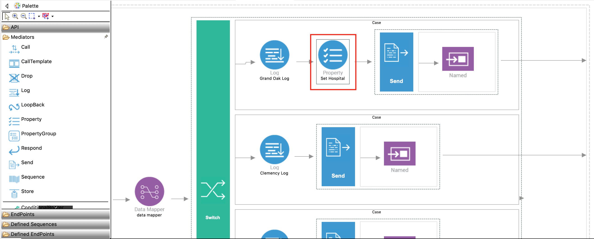
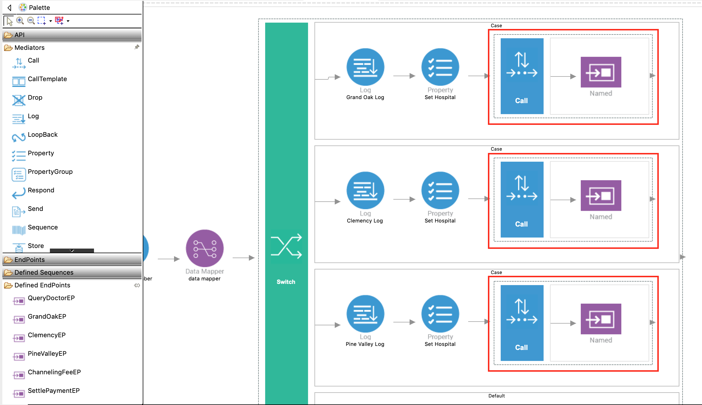
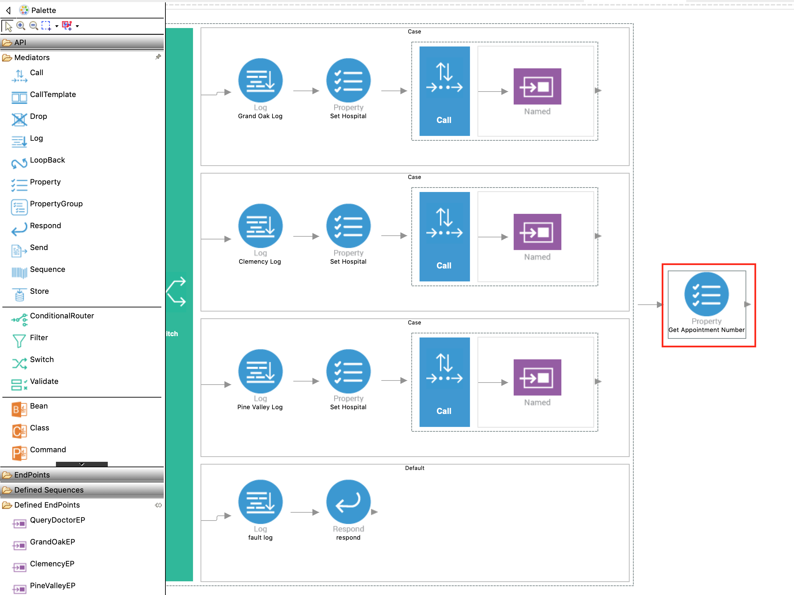
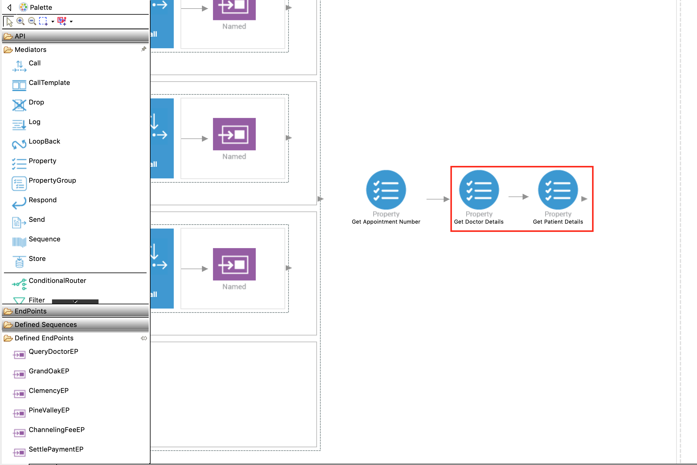
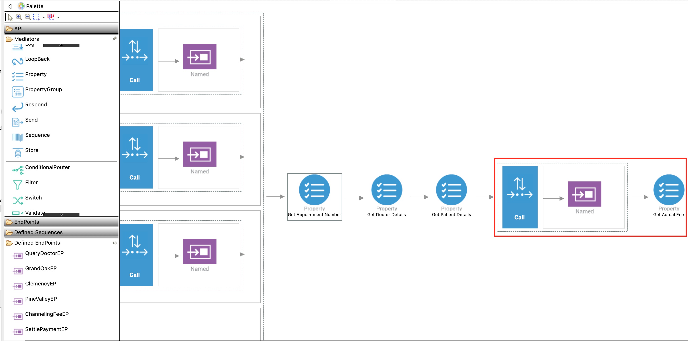
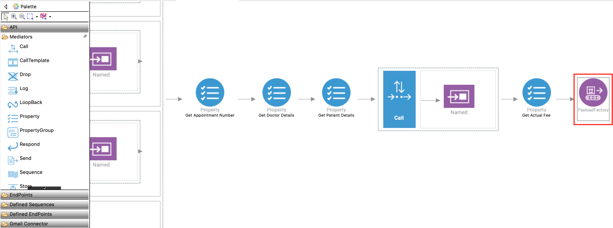
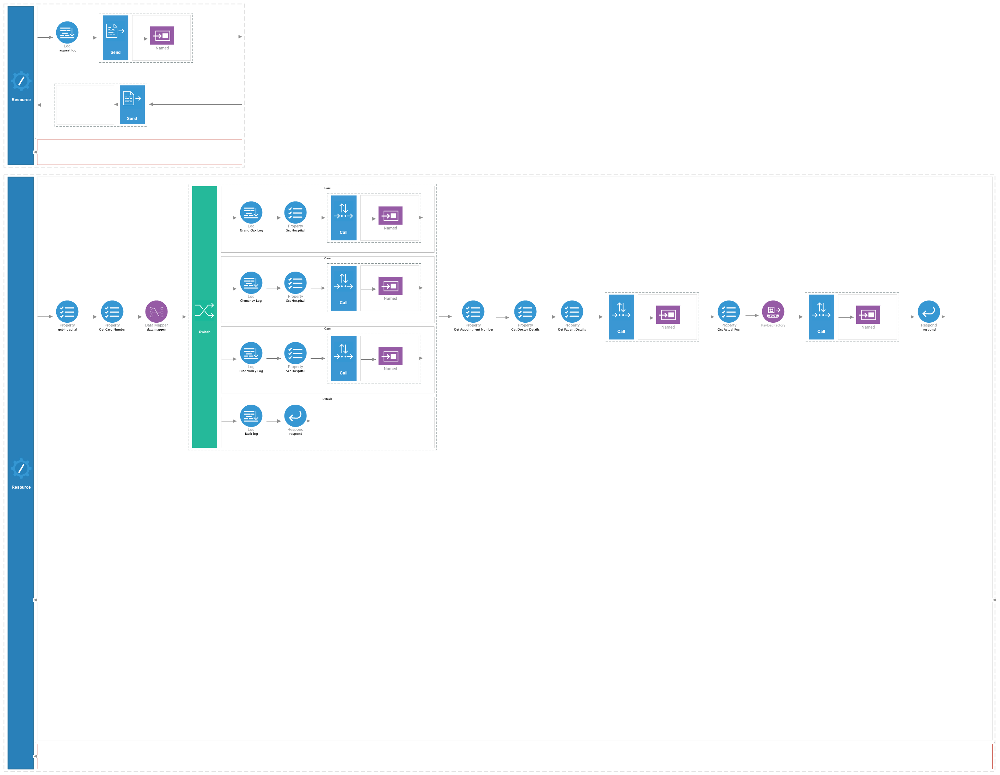

# Service Orchestration

## What you'll build

When information from several services are required to construct a response to a client request, service chaining needs to be implemented. That is, several services are integrated based on some business logic and exposed as a single, aggregated service. 

In this tutorial, when a client sends a request for a medical appointment, the Micro Integrator performs several service call to multiple back-end services in order to construct the response that includes all the necessary details. 

To build this mediation flow, you will update the API resource from the [Message Transformation](transforming-message-content.md) tutorial to send messages through the Micro Integrator to the back-end service using the **Call** mediator instead of the **Send** mediator. The Call mediator allows you to specify all service invocations one after the other within a single sequence. You will then use the **PayloadFactory** mediator to take the response from one back-end service and change it to the format that is accepted by the other back-end service.

## Let's get started!

### Step 1: Set up the workspace

Set up WSO2 Integration Studio as follows:

1.  Download the relevant [WSO2 Integration Studio](https://wso2.com/integration/tooling/) based on your operating system.
2.  Set up the project from the [Message Transformation](transforming-message-content.md) tutorial:

    !!! Note
        This tutorial is a continuation of the [Message Transformation](transforming-message-content.md) tutorial.

    1.  Download the [pre-packaged project](https://github.com/wso2-docs/WSO2_EI/blob/master/Integration-Tutorial-Artifacts/Integration-Tutorial-Artifacts-EI7.1.0/message-transformation-tutorial.zip).
    2.  Open WSO2 Integration Studio and go to **File -> Import**. 
    3.  Select **Existing WSO2 Projects into workspace** under the **WSO2** category, click **Next**, and then upload the **prepackaged project**.

### Step 2: Develop the integration artifacts

#### Create new Endpoints

Let's create new HTTP endpoints to represent the back-end services that are required for checking the channelling fee and to settle the payment.

1.  Right click **SampleServicesConfigs** in the Project Explorer and navigate to **New -> Endpoint**. 
2.  Ensure **Create a New Endpoint** is selected and click **Next.**
3.  Enter the details given below:
    <table>
        <tr>
            <th>Property</th>
            <th>Value</th>
            <th>Description</th>
        </tr>
        <tr>
            <td>Endpoint Name</td>
            <td>ChannelingFeeEP</td>
            <td>The name of the endpoint.</td>
        </tr>
        <tr>
            <td>Endpoint Type</td>
            <td>
               <code>HTTP Endpoint</code>
            </td>
            <td>
                Indicates that the back-end service is HTTP.
            </td>
        </tr>
        <tr>
            <td>URI Template</td>
            <td>
                <code>http://localhost:9090/{uri.var.hospital}/categories/appointments/{uri.var.appointment_id}/fee</code>
            </td>
            <td>
                The template for the request URL expected by the back-end service.
            </td>
        </tr>
        <tr>
            <td>Method</td>
            <td>
                <code>GET</code>
            </td>
            <td>
                This endpoint artifact will be used to get information from the back-end service.
            </td>
        </tr>
        <tr>
         <td>Static Endpoint</td>
         <td><br/>
         </td>
         <td>Select this option because we are going to use this endpoint only in this ESB Config module and will not reuse it in other projects.</br/></br/> <b>Note</b>: If you need to create a reusable endpoint, save it as a Dynamic Endpoint in either the Configuration or Governance Registry.</td>
      </tr>
      <tr>
         <td>Save Endpoint in</td>
         <td><code>               SampleServicesConfigs            </code></td>
         <td>This is the ESB Config module.</td>
      </tr>
    </table>

4.  Click **Finish**.

    

5.  Create another endpoint for the Settle Payment back-end service and specify the details given below:
    <table>
        <tr>
            <th>Property</th>
            <th>Value</th>
            <th>Description</th>
        </tr>
        <tr>
            <td>Endpoint Name</td>
            <td>SettlePaymentEP </td>
            <td>The name of the endpoint.</td>
        </tr>
        <tr>
            <td>Endpoint Type</td>
            <td>
               <code>HTTP Endpoint</code>
            </td>
            <td>
                Indicates that the back-end service is HTTP.
            </td>
        </tr>
        <tr>
            <td>URI Template</td>
            <td>
                <code>http://localhost:9090/healthcare/payments</code>
            </td>
            <td>
                The template for the request URL expected by the back-end service.
            </td>
        </tr>
        <tr>
            <td>Method</td>
            <td>
                <code>POST </code>
            </td>
            <td>
                This endpoint artifact will be used to post informtion to the back-end service.
            </td>
        </tr>
        <tr>
         <td>Static Endpoint</td>
         <td><br/>
         </td>
         <td>Select this option because we are going to use this endpoint only in this ESB Config module and will not reuse it in other projects.</br/></br/> <b>Note</b>: If you need to create a reusable endpoint, save it as a Dynamic Endpoint in either the Configuration or Governance Registry.</td>
      </tr>
      <tr>
         <td>Save Endpoint in</td>
         <td><code>SampleServicesConfigs</code></td>
         <td>This is the ESB Config module.</td>
      </tr>
    </table>

6.  Click **Finish**.

    

You have now created the additional endpoints that are required for this tutorial.

#### Update the mediation flow

You can now start updating the API resource with the mediation flow.

1.  Add a new **Property** mediator just after the **Get Hospital** Property mediator in the In Sequence of the API resource to retrieve and store the card number that is sent in the request payload.

      

2.  With the Property mediator selected, access the Properties tab and specify the following details:

    <table>
        <tr>
            <th>Property</th>
            <th>Description</th>
        </tr>
      <tr class="odd">
         <td>Property Name</td>
         <td>Enter <code>               New Property...              </code>.</td>
      </tr>
      <tr class="even">
         <td>New Property Name</td>
         <td>Enter <code>card_number             </code>.</td>
      </tr>
      <tr class="odd">
         <td>Property Action</td>
         <td>Enter <code>               set              </code>.</td>
      </tr>
      <tr class="even">
        <td>Value</td>
        <td>
            <div class="content-wrapper">
                <p>Follow the steps given below to specify the expression:</p>
                
                <ol>
                    <li>Click the <strong>Ex</strong> button before the <b>Value</b> field. This specifies the value type as <i>expression</i>.</li>
                    <li>
                      Now, click the <strong>f</strong> button to open the <b>Expression Selector</b> dialog box.
                    </li>
                    <li>Enter <code>json-eval($.cardNo)</code> as the expression value.</li>
                </ol>
                    <b>Note</b>:
                    This is the JSONPath expression that will extract the card number from the request payload.
            </div>
        </td>
      </tr>
      <tr>
          <td>Description</td>
          <td>Get Card Number</td>
      </tr>
    </table>

3. Go to the first case box of the Switch mediator. Add a Property mediator just after the Log mediator to store the value for the `          uri.var.hospital         ` variable that will be used when sending requests to **ChannelingFeeEP** service. 

    

4.  With the Property mediator selected, access the Properties tab and specify the following details:
    <table>
        <tr>
            <th>Property</th>
            <th>Description</th>
        </tr>
      <tr class="odd">
         <td>Property Name</td>
         <td>Enter <code>               New Property...              </code>.</td>
      </tr>
      <tr class="even">
         <td>New Property Name</td>
         <td>Enter <code>uri.var.hospital </code>.</td>
      </tr>
      <tr class="odd">
         <td>Property Action</td>
         <td>Enter <code>               set              </code>.</td>
      </tr>
      <tr>
          <td>Property Data Type</td>
          <td>STRING</td>
      </tr>
      <tr class="odd">
         <td>Value</td>
         <td>
            <code>grandoaks</code>
         </td>
      </tr>
      <tr>
          <td>Description</td>
          <td>Set Hospital Variable</td>
      </tr>
    </table>

5.  Similarly, add property mediators in the other two case boxes in the Switch mediator. Change only the **Value** field as follows:
    -   Case 2: `clemency`
    -   Case 3: `pinevalley`  

    

6.  Delete the Send mediator by right clicking on the mediator and selecting **Delete from Model**. Replace this with a Call mediator from the **Mediators** palette and add GrandOakEP from the **Defined Endpoints** palette to the empty box adjoining the Call mediator.  
      
7.  Replace the Send mediators in the following two case boxes as well and add ClemencyEP and PineValleyEP to the respective boxes adjoining the Call mediators.  
    

    !!! Info
        Using the Call mediator allows us to define other service invocations following this mediator.
    
    Let's use Property mediators to retrieve and store the values that you get from the response you receive from GrandOakEP, ClemencyEP, or PineValleyEP.

8.  Next to the Switch mediator, add a Property mediator to retrieve and store the value sent as `appointmentNumber` .

     

9.  With the Property mediator selected, access the Properties tab and specify the following details:

    <table>
    <thead>
    <tr class="header">
    <th>Property</th>
    <th>Description</th>
    </tr>
    </thead>
    <tbody>
    <tr class="odd">
    <td>Property Name</td>
    <td>Select <strong>New Property</strong>.</td>
    </tr>
    <tr class="even">
    <td>New Property Name</td>
    <td>Enter <code>uri.var.appointment_id</code>.<br />
    This value is used when invoking <b>ChannelingFeeEP</b>.</td>
    </tr>
    <tr class="odd">
    <td>Property Action</td>
    <td><p>Select <strong>set</strong></p></td>
    </tr>
    <tr class="even">
        <td>Value</td>
        <td>
            <div class="content-wrapper">
                <p>Follow the steps given below to specify the expression:</p>
                
                <ol>
                    <li>Click the <strong>Ex</strong> button before the <b>Value</b> field. This specifies the value type as <i>expression</i>.</li>
                    <li>
                      Now, click the <strong>f</strong> button to open the <b>Expression Selector</b> dialog box.
                    </li>
                    <li>Enter <code>json-eval($.appointmentNumber)</code> as the expression value.</li>
                </ol>
                    <b>Note</b>:
                    This is the JSONPath expression that will extract the appointment number from the request payload.
            </div>
        </td>
    </tr>
    <tr class="even">
    <td>Description</td>
    <td>Get Appointment Number</td>
    </tr>
    </tbody>
    </table>

    !!! Note
        You derive the **Value Expression** in the above table from the following response that is received from GrandOakEP, ClemencyEP, or PineValleyEP:
        ```json
        {"appointmentNumber":1,   "doctor":
            {"name":"thomas collins",
                     "hospital":"grand oak community hospital",
                     "category":"surgery","availability":"9.00 a.m - 11.00 a.m",
                     "fee":7000.0},
               "patient":
                   {"name":"John Doe",
                    "dob":"1990-03-19",
                    "ssn":"234-23-525",
                    "address":"California",
                    "phone":"8770586755",
                    "email":"johndoe@gmail.com"},
               "fee":7000.0,
               "confirmed":false}
        ```

10.  Similarly, add two more Property mediators. They will retrieve and store the `           doctor          ` details and `           patient          ` details respectively from the response that is received from GrandOakEP, ClemencyEP, or PineValleyEP.

      - To store `doctor` details:

          <table>
            <tr>
              <th>Property</th>
              <th>Description</th>
            </tr>
            <tr>
              <td>Property Name</td>
              <td>
                  Select <strong>New Property</strong>.
              </td>
            </tr>
            <tr>
              <td>New Property Name</td>
              <td>
                 Enter <code>doctor_details</code>.
              </td>
            </tr>
            <tr>
              <td>Property Action</td>
              <td>
                Select <strong>set</strong>.
              </td>
            </tr>
            <tr class="even">
                <td>Value</td>
                <td>
                    <div class="content-wrapper">
                        <p>Follow the steps given below to specify the expression:</p>
                        
                        <ol>
                            <li>Click the <strong>Ex</strong> button before the <b>Value</b> field. This specifies the value type as <i>expression</i>.</li>
                            <li>
                              Now, click the <strong>f</strong> button to open the <b>Expression Selector</b> dialog box.
                            </li>
                            <li>Enter <code>json-eval($.doctor)</code> as the expression value.</li>
                        </ol>
                            <b>Note</b>:
                            This is the JSONPath expression that will extract the doctor details from the request payload.
                    </div>
                </td>
            </tr>
            <tr>
              <td>Description</td>
              <td>
                 Get Doctor Details
              </td>
            </tr>
          </table>

      - To store `patient` details:

          <table>
            <tr>
              <th>Property</th>
              <th>Description</th>
            </tr>
            <tr>
              <td>Property Name</td>
              <td>Select <strong>New Property</strong></td>
            </tr>
            <tr>
              <td>New Property Name</td>
              <td>
                Enter <code>patient_details</code>
              </td>
            </tr>
            <tr>
              <td>Property Action</td>
              <td>
                Select <strong>set</strong>
              </td>
            </tr>
            <tr class="even">
                <td>Value</td>
                <td>
                    <div class="content-wrapper">
                        <p>Follow the steps given below to specify the expression:</p>
                        
                        <ol>
                            <li>Click the <strong>Ex</strong> button before the <b>Value</b> field. This specifies the value type as <i>expression</i>.</li>
                            <li>
                              Now, click the <strong>f</strong> button to open the <b>Expression Selector</b> dialog box.
                            </li>
                            <li>Enter <code>json-eval($.patient)</code> as the expression value.</li>
                        </ol>
                            <b>Note</b>:
                            This is the JSONPath expression that will extract the patient details from the request payload.
                    </div>
                </td>
            </tr>
            <tr>
              <td>Description</td>
              <td>
                 Get Patient Details
              </td>
            </tr>
          </table>

    

11.  Add a Call mediator and add the ChannelingFeeEP endpoint from the **Defined Endpoints** palette to the empty box adjoining the Call mediator.
12.  Add a Property mediator adjoining the Call mediator box to retrieve and store the value sent as `actualFee`. 
13.  Access the Property tab of the mediator and specify the following details:

      <table>
            <tr>
              <th>Property</th>
              <th>Description</th>
            </tr>
            <tr>
              <td>Property Name</td>
              <td>Select <strong>New Property</strong></td>
            </tr>
            <tr>
              <td>New Property Name</td>
              <td>
                  Enter <code>actual_fee</code></br></br>
                  <b>Note</b>: This value is used when invoking <a src="#ExposingSeveralServicesasaSingleService-Settle">SettlePaymentEP</a>.
              </td>
            </tr>
            <tr>
              <td>Property Action</td>
              <td>
                Select <strong>set</strong>
              </td>
            </tr>
            <tr class="even">
                <td>Value</td>
                <td>
                    <div class="content-wrapper">
                        <p>Follow the steps given below to specify the expression:</p>
                        
                        <ol>
                            <li>Click the <strong>Ex</strong> button before the <b>Value</b> field. This specifies the value type as <i>expression</i>.</li>
                            <li>
                              Now, click the <strong>f</strong> button to open the <b>Expression Selector</b> dialog box.
                            </li>
                            <li>Enter <code>json-eval($.actualFee)</code> as the expression value.</li>
                        </ol>
                    </div>
                </td>
            </tr>
            <tr>
              <td>
                  Description
              </td>
              <td>
                  Get Actual Fee
              </td>
            </tr>
          </table>

    
    
    !!! Note
        You derive the Value Expression in the above table from the following response that is received from ChannelingFeeEP:
        ```
        {"patientName":" John Doe ", 
        "doctorName":"thomas collins", 
        "actualFee":"7000.0"}
        ```     

14. Let's use the **PayloadFactory** mediator to construct the following message payload for the request sent to SettlePaymentEP.

    ```json
    {"appointmentNumber":2,
        "doctor":{
            "name":"thomas collins",
            "hospital":"grand oak community hospital",
            "category":"surgery",
            "availability":"9.00 a.m - 11.00 a.m",
            "Fee":7000.0
        },
        "patient":{
            "name":"John Doe",
            "Dob":"1990-03-19",
            "ssn":"234-23-525",
            "address":"California",
            "phone":"8770586755",
            "email":"johndoe@gmail.com"
        },
        "fee":7000.0,
        "Confirmed":false,
        "card_number":"1234567890"
    }
    ```

15.  Add a PayloadFactory mediator (from the **mediators** palette) next to the Property mediator to construct the above message payload.
       

16. With the Payloadfactory mediator selected, access the properties tab of the mediator and specify the following details:

    | Property       |Descripttion                                                                                            |
    |----------------|--------------------------------------------------------------------------------------------------------|
    | Payload Format | Select <strong>Inline</strong>                                                                         |
    | Media Type     | Select <strong>json</strong>                                                                           |
    | Payload        | `{"appointmentNumber":$1, "doctor":$2, "patient":$3, "fee":$4, "confirmed":"false", "card_number":"$5"}`</br></br> This is the message payload to send with the request to SettlePaymentEP. In this payload, $1, $2, $3, $4, and $5 indicate variables. |
    
17. To add the arguments for the PayloadFactory mediator:
    1. Click the **plus** icon () in the **Args** field to open the **PayloadFactoryArgument** dialog. 
    2. Enter the following information in the **PayloadFactoryArgument** dialog box. This provides the argument that defines the actual value of the first variable (used in the format definition given in the previous step).

        !!! Tip
            To avoid getting an error message, first select the **Media Type** before providing the **Payload.**

        <table>
          <tr>
            <th>Property</th>
            <th>Description</th>
          </tr>
          <tr>
            <td>
              Argument Type
            </td>
            <td>
              Select <code>Expression</code>.
            </td>
          </tr>
          <tr class="even">
             <td>Argument Expression</td>
             <td>
                <div class="content-wrapper">
                  <p>Follow the steps given below to specify the expression:</p>
                <ol>
                    <li>Click the text box for the <strong>Argument Expression</strong> field. This opens the <b>Expression Selector</b> dialog.</li>
                   <li>Select <strong>Expression</strong> from the list.
                    </li>
                   <li>
                      Enter `$ctx:uri.var.appointment_id`.
                      Note that the `$ctx` method is similar to using the <code>get-property</code> method. This method checks in the message context.
                   </li>
                   <li>Click <strong>OK.</strong> <strong><br/>
                      </strong>
                   </li>
                </ol>
                </div>
             </td>
          </tr>
          <tr>
            <td>
                Evaluator
            </td>
            <td>
                Select <code>xml</code>.</br></br>
                This indicates that the expression is provided in XML.
            </td>
          </tr>
        </table>
    
18. Similarly, click **Add** and add more arguments to define the other variables that are used in the message payload format definition. Use the following as the **Value** for each of them:

    -   `$ctx:doctor_details`  
    -   `$ctx:patient_details`  
    -   `$ctx:actual_fee`  
    -   `$ctx:card_number`  

    

19. Add a Call mediator and add SettlePaymentEP from the Defined Endpoints palette to the empty box adjoining the Call mediator.
20. Add a **Respond** mediator to send the response to the client. 

You should now have a completed configuration that looks like this: 



### Step 3: Package the artifacts

Package the artifacts in your composite exporter (SampleServicesCompositeExporter) to be able to deploy the artifacts in the server.

1.  Open the `          pom.xml         ` file in the composite exporter.
2.  Ensure that the following projects and artifacts are selected in the POM file.

    -   SampleServicesCompositeExporter
        -   `HealthcareAPI`
        -   `ClemencyEP`
        -   `GrandOakEP`
        -   `PineValleyEP`
        -   `ChannelingFeeEP`
        -   `SettlePaymentEP`
    -   SampleServicesRegistryResources

3.  Save the changes.

### Step 4: Build and run the artifacts

To test the artifacts, deploy the [packaged artifacts](#step-3-package-the-artifacts) in the embedded Micro Integrator:

1.  Right-click the composite exporter module and click **Export Project Artifacts and Run**.
2.  In the dialog box that opens, confirm that the required artifacts from the composite exporter module are selected.     
4.  Click **Finish**. 

The artifacts will be deployed in the embedded Micro Integrator and the server will start.

- See the startup log in the **Console** tab.
- See the URLs of the deployed services and APIs in the **Deployed Services** tab.

### Step 5: Test the use case

Let's test the use case by sending a simple client request that invokes the service.

#### Start the back-end service

1. Download the JAR file of the back-end service from [here](https://github.com/wso2-docs/WSO2_EI/blob/master/Back-End-Service/Hospital-Service-JDK11-2.0.0.jar).
2. Open a terminal, navigate to the location where your saved the back-end service.
3. Execute the following command to start the service:

    ```bash
    java -jar Hospital-Service-JDK11-2.0.0.jar
    ```

#### Send the client request

Let's send a request to the API resource to make a reservation. You can use the embedded <b>HTTP Client</b> of WSO2 Integration Studio as follows:

1. Open the <b>HTTP Client</b> of WSO2 Integration Studio.

    !!! Tip
        If you don't see the <b>HTTP Client</b> pane, go to <b>Window -> Show View - Other</b> and select <b>HTTP Client</b> to enable the client pane.

    
    
2. Enter the request information as given below and click the <b>Send</b> icon ().
    
    <table>
        <tr>
            <th>Method</th>
            <td>
               <code>POST</code> 
            </td>
        </tr>
        <tr>
            <th>Headers</th>
            <td>
              <code>Content-Type=application/json</code>
            </td>
        </tr>
        <tr>
            <th>URL</th>
            <td><code>http://localhost:8290/healthcare/categories/surgery/reserve</code></br></br>
              <ul>
                <li>
                  The URI-Template format that is used in this URL was defined when creating the API resource:
          <code>http://<host>:<port>/categories/{category}/reserve</code>.
                </li>
              </ul>
            </td>
        </tr>
        <tr>
            <th>Body</th>
            <td>
            <div>
              <code>
                {
                 "name": "John Doe",
                 "dob": "1940-03-19",
                 "ssn": "234-23-525",
                 "address": "California",
                 "phone": "8770586755",
                 "email": "johndoe@gmail.com",
                 "doctor": "thomas collins",
                 "hospital": "grand oak community hospital",
                 "cardNo": "7844481124110331",
                 "appointment_date": "2025-04-02"
                }
              </code>
            </div></br>
            <ul>
              <li>
                This JSON payload contains details of the appointment reservation, which includes patient details, doctor, hospital, and data of appointment.
              </li>
            </ul>
        </tr>
     </table>
     
     

If you want to send the client request from your terminal:

1. Install and set up [cURL](https://curl.haxx.se/) as your REST client.
2. Create a JSON file named `request.json` with the following request payload.
    ```json
    {
     "name": "John Doe",
     "dob": "1940-03-19",
     "ssn": "234-23-525",
     "address": "California",
     "phone": "8770586755",
     "email": "johndoe@gmail.com",
     "doctor": "thomas collins",
     "hospital": "grand oak community hospital",
     "cardNo": "7844481124110331",
     "appointment_date": "2025-04-02"
    }
    ```
3. Open a terminal and navigate to the directory where you have saved the `request.json` file.
4. Execute the following command.
    ```json
    curl -v -X POST --data @request.json  http://localhost:8290/healthcare/categories/surgery/reserve  --header "Content-Type:application/json"
    ```

#### Analyze the response

You will see the response received to your <b>HTTP Client</b>:

```json
{  
"appointmentNo":1,
"doctorName":"thomas collins",
"patient":"John Doe",
"actualFee":7000.0,
"discount":20,
"discounted":5600.0,
"paymentID":"480fead2-e592-4791-941a-690ad1363802",
"status":"Settled"
}
```

You have now explored how the Micro Integrator can do service chaining using the Call mediator and transform message payloads from one format to another using the **PayloadFactory** mediator.
